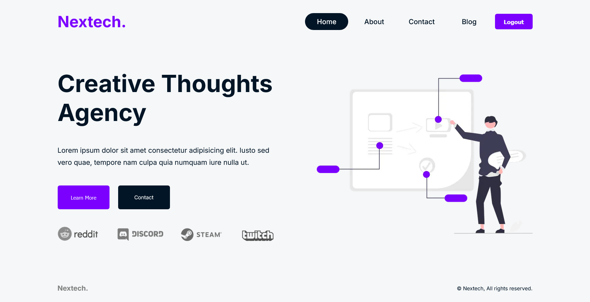
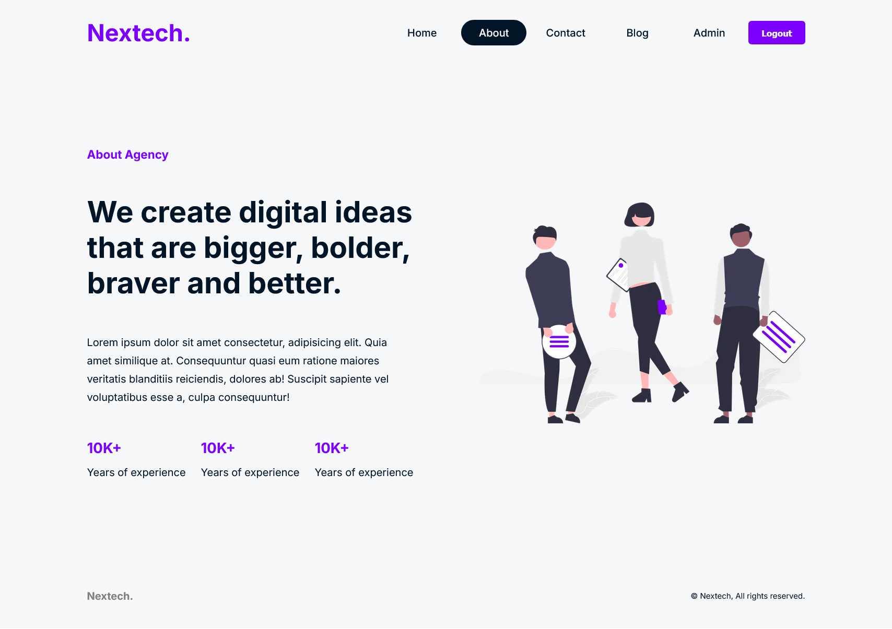

# Nextech

A company website made with NextJS.

| Preview                              |
| ------------------------------------ |
| *Homepage*<br/>   |
| *About Page*<br/> |

---

## Requirements

- npm >= 10.7.0

- node >= 20.12.2

---

## Environment Variables

- Create a `MongoDB` database.

- Create an GitHub `OAuth` App and the "*Homepage URL*" will be:
  
  `http://localhost:3000/`

- "*Authorization callback URL*" will be: `http://localhost:3000/api/auth/callback/github`

- To generate `AUTH_SECRET` open `Bash` and paste the command or use any online `Auth Secret Generator`:
  
  ```bash
  openssl rand -base64 32
  ```

- Now, you will need to create and add the following environment variables to your `.env` file

`mongoDB = YOUR_MONGO_DB_CONNECTION_STRING`

`AUTH_SECRET = ANY_SECRET_KEY`

`AUTH_URL = http://localhost:3000/api/auth`

`GITHUB_ID = YOUR_GITHUB_OAUTH_APP_CLIENT_ID`

`GITHUB_SECRET = YOUR_GITHUB_OAUTH_APP_SECRET_KEY`

---

## Installation

Open `cmd` or `bash` in the project directory.

```bash
npm install
```

## Run Locally

```bash
npm run dev
```

## To Access Admin Panel

First, register as a normal user. Then, open the `MongoDB shell` and run this command to switch to the admin user. Before run this command replace `username` and `email` with your `username` and `email`

```mongodb
db.users.updateOne(
  { username: "your_username", email: "your_email" },
  { $set: { isAdmin: true } }
)


```

## License

[MIT](https://choosealicense.com/licenses/mit/)
